# Smart AirGuard - IoT Monitoring System

<div align="center">


*An IoT-based gas monitoring and automated ventilation system for garages and workshops*

</div>

## Table of Contents
- [Overview](#overview)
- [Key Features](#key-features)
- [System Architecture](#system-architecture)
- [Hardware Requirements](#hardware-requirements)
- [Pin Assignment](#pin-assignment)
- [Software Dependencies](#software-dependencies)
- [Cloud Platforms](#cloud-platforms)
  - [Adafruit IO (MQTT Broker)](#-adafruit-io-integration)
  - [ThingSpeak (Data Logging)](#-thingspeak-integration)
  - [Node-RED (Orchestration & ML)](#node-red-integration-and-research-layer)
  - [Telegram Bot](#-telegram-bot)
- [Alert System](#-alert-system)
- [Testing](#testing)
  - [Garage Tests (Real Environment)](#garage-tests-real-environment)
  - [Home Stress Tests](#home-stress-tests)
- [Cost Estimation](#cost-estimation)
- [Model Validation Framework](#model-validation-framework)

## Overview

Smart AirGuard is an IoT-based environmental monitoring and safety system designed specifically for enclosed automotive environments such as garages and workshops. The system continuously monitors air quality (CO₂-equivalent), temperature, humidity, and occupancy using low-cost sensors, providing real-time hazard detection and automated mitigation.

Unlike traditional gas detectors, Smart AirGuard implements a hybrid communication architecture that separates safety-critical functions (running on the ESP32) from advanced analytics and experimentation (running on Node-RED). This ensures that even during network outages, the system autonomously activates ventilation and audible alarms when dangerous gas levels are detected.

The project was developed as a Master's thesis at the Polytechnic Institute of Beja, achieving 0% false positives and 0% false negatives across all experimental tests.

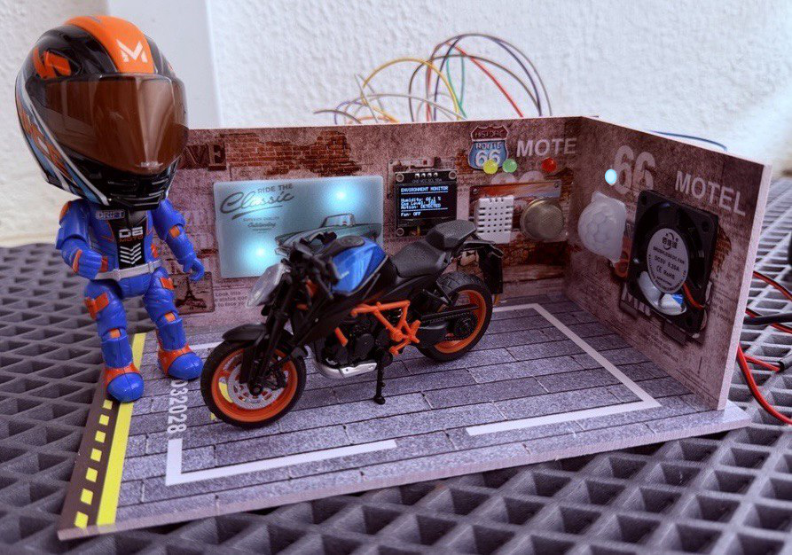

## Key Features

### 📊 **Multi-Sensor Monitoring**
- **Air Quality**: MQ-135 gas sensor for detecting harmful gases (10–5000 ppm CO₂-equivalent)
- **Temperature & Humidity**: DHT22 sensor for climate monitoring (-40°C to 80°C, 0–100% RH)
- **Occupancy Detection**: HC-SR501 PIR sensor (3–7m range)
- **Visual Indicators**: RGB LED for motion, status LEDs for alerts

### 🔔 **Smart Alert System**
- **Instant Telegram Notifications** for:
  - Dangerous gas levels 
  - Temperature extremes (<10°C or >35°C)
  - High humidity (>90%)
  - Motion detection
- **Audible Alarms**: Active buzzer for critical gas levels (>1000 ppm)
- **Visual indicators**: RGB LED (motion) + discrete LEDs (gas, temperature, humidity)

### 🌬️ **Automated Ventilation**
- **Relay-controlled fan** activates within **<1 second** of gas threshold exceedance
- Manual override via Node-RED dashboard or Telegram commands
- Automatic return to AUTO mode after 5 minutes of inactivity

### 🧠 **Advanced Analytics (Node-RED)**
- **Machine Learning predictions**: 15-minute and 30-minute gas forecasts
- **Risk assessment** (0–100%) with preventive fan activation at >70% risk
- **Model Validation** framework with MAE, RMSE, MAPE, and Accuracy metrics
- **Ten simulated hazard scenarios** for systematic testing

### 🌐 **Cloud Integration**
- **ThingSpeak Cloud**: Real-time data logging every 15 seconds
- **Telegram Bot**: Two-way communication with the system
- **Local Display**: 0.96 inch OLED for on-device monitoring

### ☁️ **Multi-Platform Cloud Architecture**
- **Adafruit IO**: MQTT broker for real-time messaging
- **ThingSpeak**: Long-term data logging with MATLAB analytics
- **Node-RED**: Orchestration, ML, testing, and dashboard
- **Telegram Bot**: User notifications and bidirectional control

### 💰 **Low Cost**
- **Total hardware cost**: ~31.01 EUR per unit
- **Free cloud tiers** for academic prototyping
- **Commercial deployment options** from 85–210 EUR/year

## System Architecture

System architecture is shown on Figure below. 

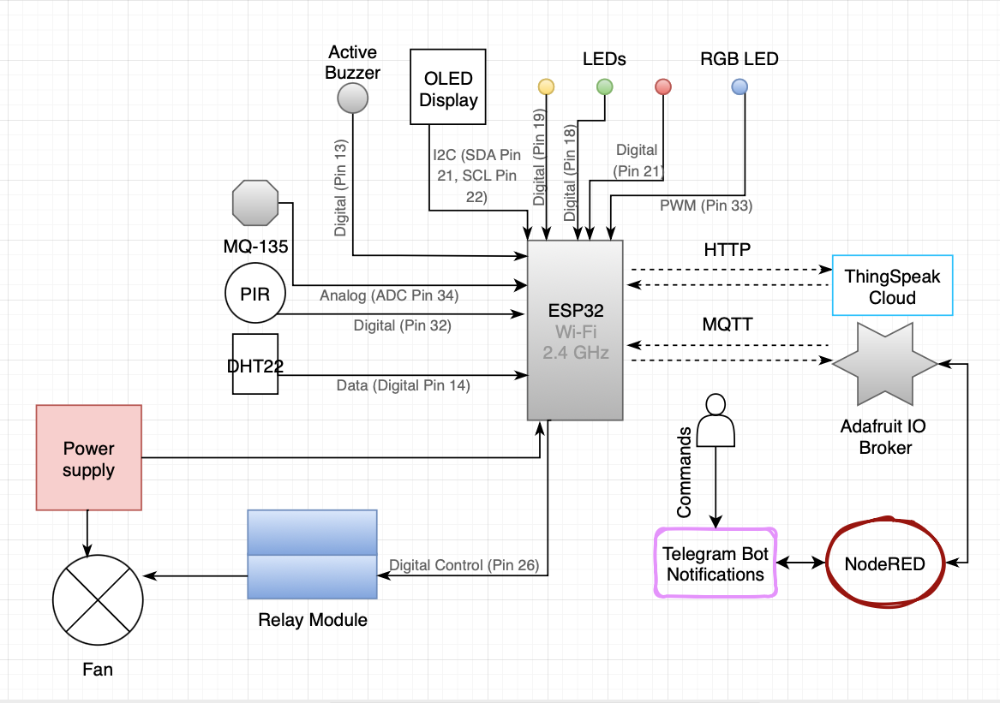

## Hardware Requirements

### **Main Components**
| Component | Quantity | Purpose |
|-----------|----------|---------|
| ESP32 DOIT DevKit V1 | 1 | Main microcontroller (dual-core, WiFi, Bluetooth) |
| DHT22 | 1 | Temperature (-40 to 80°C) & humidity (0–100% RH) |
| MQ-135 | 1 | Gas sensor (10–5000 ppm CO₂-equivalent) |
| HC-SR501 PIR | 1 | Motion detection (3–7m range) |
| 0.96" OLED (SSD1306) | 1 | Local display (128×64, I²C) |
| RGB LED (Common Cathode) | 1 | Motion status indication (blinking blue) |
| 5V 2-Channel Relay Module | 1 | Fan control (active LOW configuration) |
| DC 5V Cooling Fan | 1 | Ventilation actuator |
| Active Buzzer | 1 | Audible emergency alerts |
| LED (Red) | 1 | Gas danger indicator (>1000 ppm) |
| LED (Yellow) | 1 | Temperature alert (<10°C or >35°C) |
| LED (Green) | 1 | Humidity alert (>90%) |
| Power Bank / 5V USB | 1 | Power supply |

### **Power Requirements**
- **Input**: 5V DC via USB or external power supply
- **Current**: ~120mA (normal), ~160mA (Wi-Fi TX), ~145mA (relay active)
- **Total cost**: 31.01 EUR (all components)

## Pin Assignment

### **ESP32 Pin Configuration**

| ESP32 Pin | Component | Type | Function |
|-----------|-----------|--------|-------|
| GPIO 14 | DHT22 | Digital I/O | Temperature & Humidity |
| GPIO 34 | MQ-135 | Analog input | Gas concentration (12-bit ADC, 0–4095) |
| GPIO 32 | HC-SR501 PIR | Digital input | Motion detection (HIGH when active) |
| GPIO 23 | OLED (SDA) | I2C | I2C Data line |
| GPIO 22 | OLED (SCL) | I2C | I2C Clock line |
| GPIO 33 | RGB LED (Blue) | Digital Output | Motion status (blinking when detected) |
| GPIO 13 | Active Buzzer | Digital Output | Emergency sound (1 kHz tone) |
| GPIO 21 | Red LED | Digital Output | Gas danger (>1000 ppm) |
| GPIO 19 | Yellow LED | Digital Output | Temperature alert (<10°C or >35°C) |
| GPIO 18 | Green LED | Digital Output | Humidity alert (>90%) |
| GPIO 26 | Relay Module | Digital Output | Fan control (active LOW: LOW=ON) |


**Note:**

Relay module is active LOW: fan ON when pin = LOW, OFF when pin = HIGH (ensures fan remains off during ESP32 boot)
RGB LED (red/green channels) not used in current firmware
All LEDs use 220Ω current-limiting resistors
DHT22 data line uses 10kΩ pull-up to 3.3V
OLED I²C uses 4.7kΩ pull-ups, address 0x3C

### **Real physical board**


### **Power Connections**
- **3.3V**: DHT22, OLED, PIR sensor
- **5V**: MQ-135, Buzzer, LEDs, Relay module
- **GND**: All components

## Software Dependencies

### **Arduino Libraries Required**
```cpp
#include <Arduino.h>
#include <WiFi.h>
#include <HTTPClient.h>
#include <Wire.h>
#include <Adafruit_GFX.h>
#include <Adafruit_SSD1306.h>
#include <DHT.h>
#include <Adafruit_MQTT.h>
#include <Adafruit_MQTT_Client.h>
#include <MQ135.h>
```

### **Library Installation**
1. Open Arduino IDE
2. Go to **Tools → Manage Libraries**
3. Search and install:
```
[env:esp32dev]
platform = espressif32
board = esp32dev
framework = arduino
lib_deps = 
    adafruit/Adafruit GFX Library@^1.11.5
    adafruit/Adafruit SSD1306@^2.5.7
    adafruit/DHT sensor library@^1.4.4
    adafruit/Adafruit MQTT Library@^2.0.3
    arduino-libraries/MQ135@^1.0.0
```
**Important**: The firmware does NOT include UniversalTelegramBot.h. All Telegram communication is handled indirectly via Node-RED and MQTT.

## Cloud Platforms 

Smart AirGuard employs a **multi-platform cloud architecture** to balance real-time system responsiveness with long-term environmental data analysis. 

The system integrates **Adafruit IO**, **ThingSpeak**, and **Node-RED**, each addressing different functional and research requirements.


### 📊 ThingSpeak Integration

ThingSpeak is employed as the **data logging and analytical platform**. Sensor data is uploaded at fixed intervals and stored for long-term evaluation.

Its role within Smart AirGuard includes:

- Persistent storage of environmental sensor data

- Time-series visualization over extended periods

- Statistical analysis of gas concentration (mean, minimum, maximum)

- Weekly trend analysis and detection of missing or anomalous data

ThingSpeak supports MATLAB-based analytics, making it appropriate for **research-oriented post-processing**, while its higher latency limits its use in real-time control scenarios.

### **Data Fields Mapping**
| Field | Data | Type | Description |
|-------|------|------|-------------|
| 1 | Temperature | Float | Current temperature in °C |
| 2 | Humidity | Float | Current humidity in % |
| 3 | Gas Level | Integer | MQ-135 sensor reading |
| 4 | Motion | Binary | 1 = Detected, 0 = No motion |
| 5 | Gas Alert | Binary | 1 = Alert, 0 = Normal |
| 6 | Temp Alert | Binary | 1 = Alert, 0 = Normal |
| 7 | Humidity Alert | Binary | 1 = Alert, 0 = Normal |
| 8 | Fan Status | Binary | 1 = ON, 0 = OFF |

#### **Dashboard Configuration**
Widgets created in ThingSpeak to visualize:
- Temperature & Humidity graphs
- Gas level history
- Motion detection timeline
- Alert status indicators
- Weekly Gas Level Analytics


#### Weekly Gas Level Analytics
This module analyzes gas concentration data collected by the Smart AirGuard system and stored on ThingSpeak.

What It Does:

- Retrieves gas level and alert data for the last 7 days
- Handles UTC → local (Portugal) timezone conversion
- Processes data on a daily basis


  
- Key Metrics

- Daily mean, maximum, and minimum gas levels

- Alert count per day

- Detection of days with missing data

📉 Visualizations

- Daily gas level time-series comparison

- Bar charts of daily statistics

- Alert frequency per day

- Distribution plots with safety thresholds (warning & danger levels)

## 🤖 Adafruit IO Integration

Adafruit IO is MQTT Broker used as the **primary real-time communication layer** of the Smart AirGuard system. It provides low-latency, MQTT-based data exchange between the ESP32 device and external services.

In this project, Adafruit IO is responsible for:

- Real-time streaming of sensor data (temperature, humidity, gas concentration, motion)

- Bidirectional communication for actuator control (fan ON/OFF)

- Instant synchronization between the ESP32 and external dashboards

- Event-driven data delivery suitable for automation workflows

Due to its low latency and native MQTT support, Adafruit IO is well suited for **interactive monitoring and immediate response**, but it is not optimized for long-term analytical processing.


## Node-RED Integration and Research Layer

Node-RED is used as an **integration, automation, and experimentation layer** within the Smart AirGuard architecture. It subscribes to real-time MQTT data streams from Adafruit IO and enables flexible data processing without modifying the ESP32 firmware.

### Node-RED core functional modules:

**1 MODULE - MQTT Input Flows**

Function: Subscribe to Adafruit IO feeds

Key features: Universal parser handles JSON, CSV, and numeric values; extracts sensor readings from MQTT payloads

**2 MODULE - Data Processing**

Function: Normalize, validate, transform data

Key features: Topic normalization (feed IDs → human-readable names), data validation (range checking), filters malformed readings

Node-RED nodes for Modules 1 - MQTT Input Flows and 2 - Data Processing are shown on Figure below:

**3 MODULE - Dashboard Visualization**

Function: Real-time UI updates

Key features: Calibrated gauges with color-coded ranges, LED-style indicators, time-series charts, numerical displays

Node-RED nodes for Modules 1 - MQTT Input Flows, 2 - Data Processing and 3 - Dashboard Visualisation are shown on Figure below:

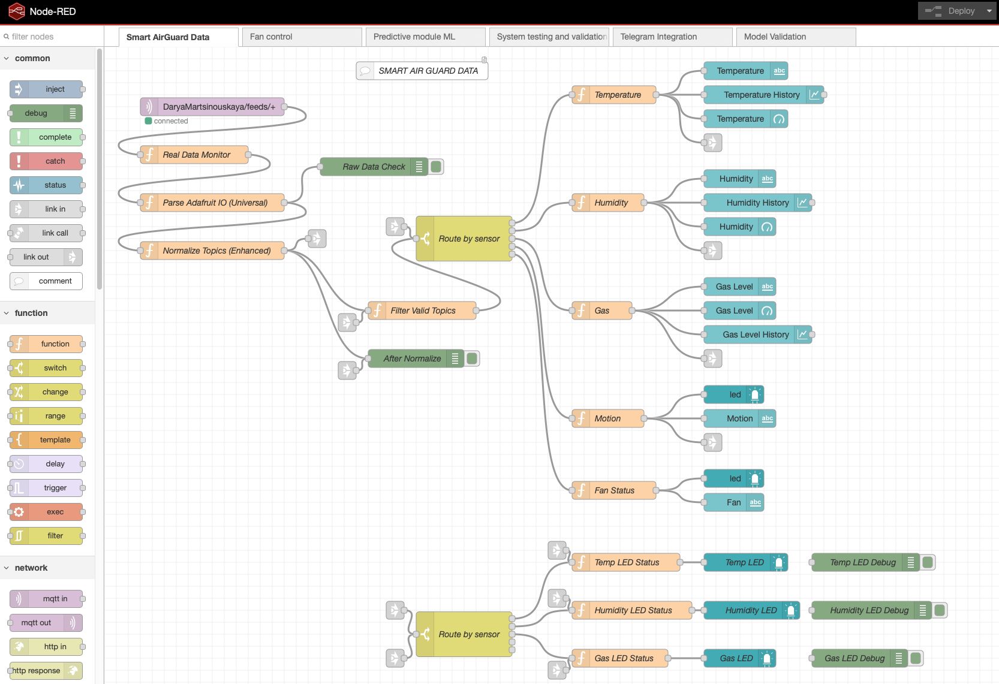

Node-RED UI Interface for Modules 1-3 is shown below as well:

- Common data:

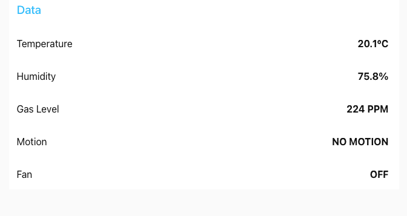

- LED status monitoring for gas, temperature, and humidity alerts:

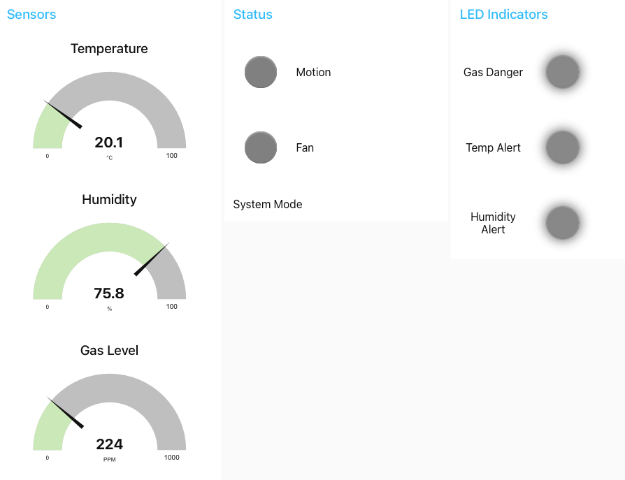

- And historical trends:

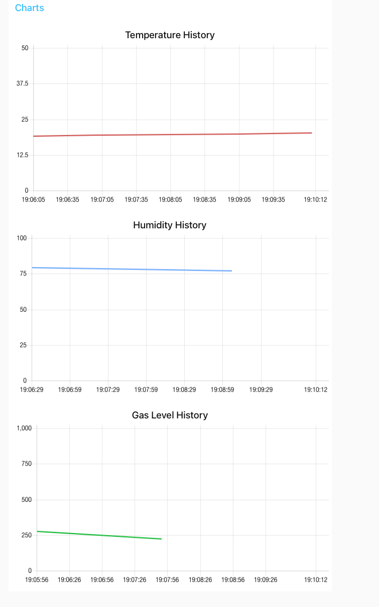

**4 MODULE - ML Prediction**

Function: Gas forecasting & risk assessment

Key features: 12-reading buffer (~1 hour), 15/30-min forecasts, risk level (0-100%), preventive fan activation at >70% risk

Node-RED nodes for Module 4 - ML Prediction are shown on Figure below:

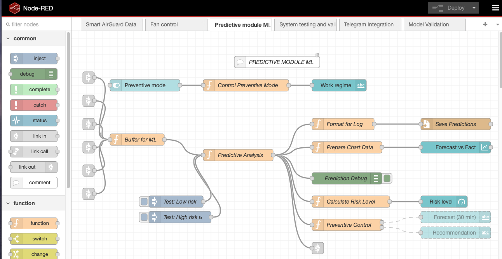

Node-RED implements a predictive module that maintains a buffer of the last 12 sensor readings (approximately one hour of data). Based on current trends, temperature effects, humidity levels, and occupancy patterns, the system calculates 15-minute and 30-minute gas concentration forecasts. A normalized risk level (0-100%) is derived from these predictions. When the risk exceeds 70%, Node-RED automatically activates the ventilation fan preventively, before dangerous thresholds (1000 ppm) are reached. 

UI of predictive module with buffer and forecasting logic:

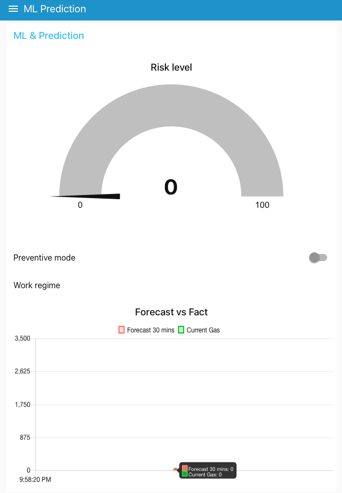

**5 MODULE - Model Validation**

Function: Prediction accuracy monitoring

Key features: Real-time MAE, RMSE, MAPE, Accuracy metrics; sliding window validation (6-sample offset)

Node-RED nodes for Module 4 - Model Validation are shown on Figure below:

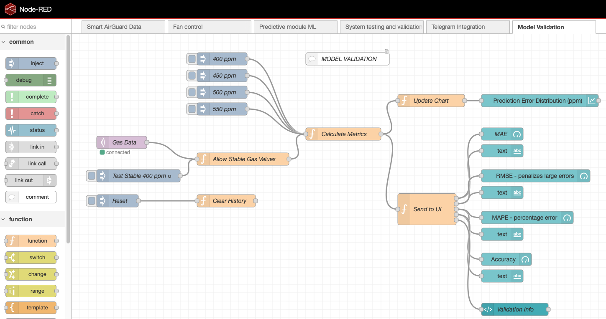

A sliding window validation framework continuously assesses prediction accuracy by comparing each new gas reading against the value predicted 6 samples earlier (approximately 30 seconds). 

Four metrics are calculated in real time. 

MAE (Mean Absolute Error) measures average prediction deviation in ppm (target <50 ppm). 

RMSE (Root Mean Square Error) penalizes large errors more heavily (target <75 ppm). 

MAPE (Mean Absolute Percentage Error) expresses error as a percentage (target <15%). 

Accuracy is a derived metric showing prediction quality as a percentage (target >80%). 

Under normal conditions, MAE stays below 15 ppm and Accuracy above 95%. During sudden gas spikes, errors temporarily increase but recover to baseline within 30-60 seconds.

UI:

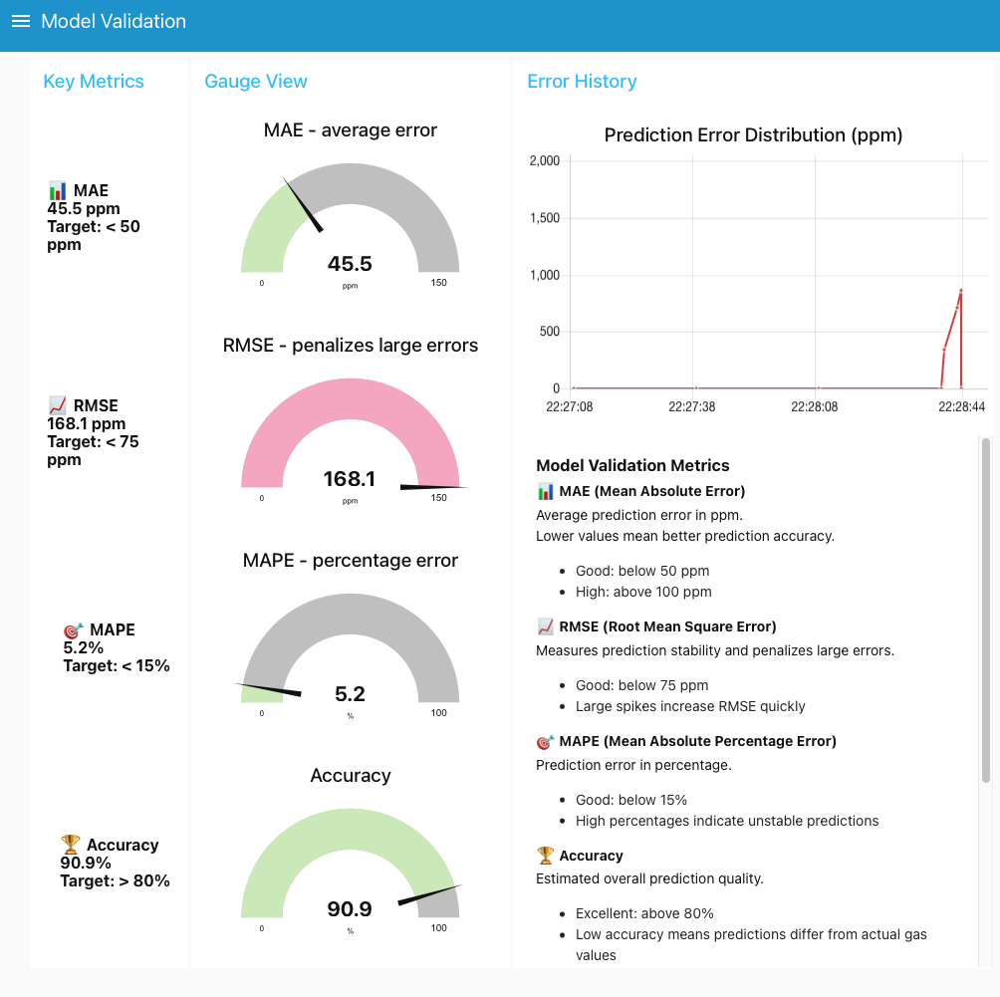


**6 MODULE - Testing Panel**

Function: Software-based validation

Key features: 10 simulated hazard scenarios, auto-test sequence, direct sensor injection, test mode controller

Node-RED nodes for 6 - Testing Panel are shown on Figure below:

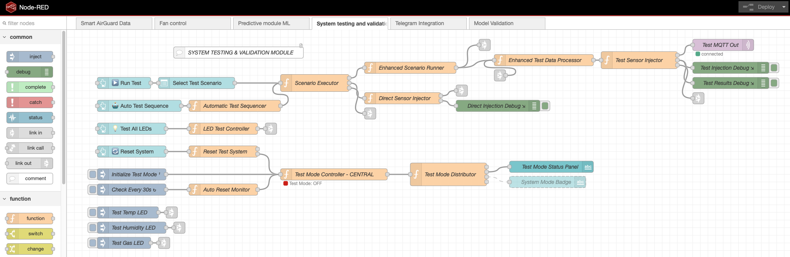

The Testing Panel includes ten scientifically-grounded scenarios that inject predefined sensor data directly into the processing pipeline, bypassing the physical MQTT broker. Scenarios cover normal conditions (22°C, 55% humidity, 450 ppm gas), exhaust gases at health-hazard (1200 ppm) and life-threatening (2500 ppm) levels, garage fire (85°C, 3000 ppm), mold formation risk (90% humidity at 18°C), metal corrosion risk (95% humidity at 15°C), heat stroke risk (42°C, 80% humidity), overcrowded office (1400 ppm CO₂ from respiration), barbecue/cooking (40°C, 90% humidity, 1100 ppm), and industrial gas leak (2800 ppm, no motion). Each scenario includes expected system states for automated verification.

UI:

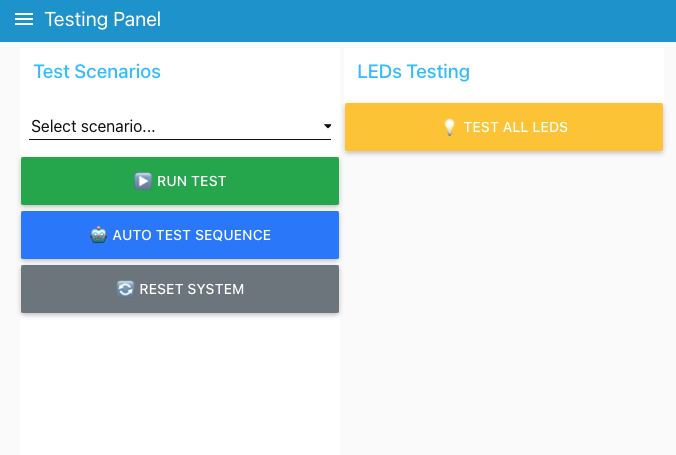

Test mode controller for scenario-based validation:

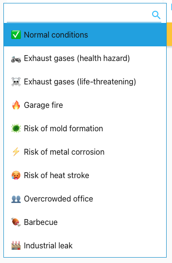

When Test Mode is activated via the dashboard, the system ignores all incoming MQTT messages from the physical broker and accepts only internally generated test messages. This enables isolated software validation without physical sensor noise. The Auto Test Sequence cycles through all ten scenarios automatically (10 seconds each with 10-second intervals, total 100 seconds). The Direct Sensor Injector substitutes predefined sensor values directly. An auto-reset timer automatically disables Test Mode after 2 minutes of inactivity, reverting to normal operation. Dedicated injector nodes also allow manual testing of LEDs and the fan actuator for hardware-in-the-loop validation.

**7 MODULE - Telegram Bridge**

Function: Bidirectional user messaging

Key features: Polls Telegram API (2s), forwards commands to MQTT, sends automatic alerts from events feed

Node-RED nodes for 7 - Telegram Bridge are shown on Figure below:

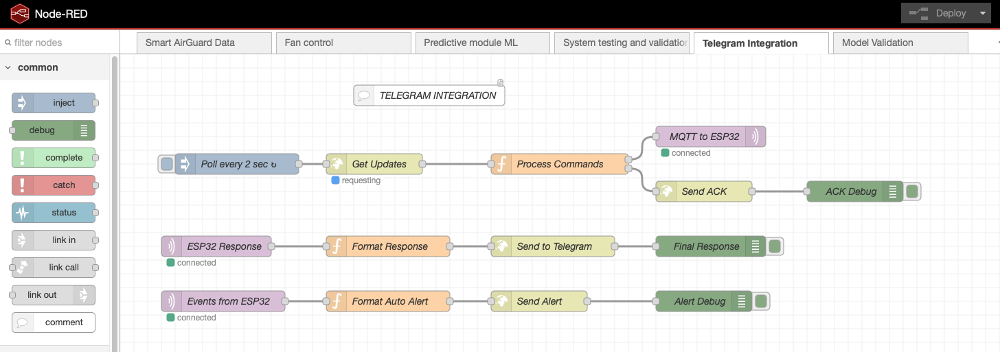

The Telegram Bridge implements three independent pipelines, completely isolating the ESP32 from direct Telegram API communication. 

Command Pipeline (User → ESP32): Node-RED polls the Telegram API every 2 seconds, parses incoming messages, and publishes parsed commands to the MQTT telegram_commands feed. The ESP32 subscribes to this feed and processes commands. 

Response Pipeline (ESP32 → User): The ESP32 publishes responses to the telegram_response feed. Node-RED formats them with Markdown and forwards to Telegram API via HTTP POST. 

Auto-Notification Pipeline (ESP32 → User): For critical events, the ESP32 publishes alerts to the events feed. Node-RED formats these with emoji indicators and automatically sends them to the user. 

The first user to interact with the bot is automatically registered as the notification recipient, with the chat ID stored in Node-RED's flow context. The ESP32 never stores the bot token, handles TLS certificates, or parses Telegram JSON.

The bot supports seven commands. 

/start or /help display the available command list. 

/status returns full system status: gas concentration with danger indicators, temperature with alert status, humidity, motion state, fan state, and current mode (MANUAL/AUTO). 

/sensors outputs only current sensor readings. /alerts lists active hazard conditions (gas danger, temperature excursions, high humidity, motion). 

/fan on, /fan off, and /fan auto provide remote fan control: the first two switch to manual mode, the third returns to automatic mode. Upon receiving any valid command, Node-RED immediately sends a "Command received" acknowledgment. Critical safety feature: /fan off is blocked during gas emergencies (gas > 1000 ppm), returning "Cannot turn fan OFF! Gas emergency is ACTIVE!"

**8 MODULE - Fan Control**

Function: Manual override

Key features: Dashboard toggle switch + Telegram commands, priority handling, auto-mode timeout (5 min)

Node-RED nodes for 8 - Fan Control are shown on Figure below:

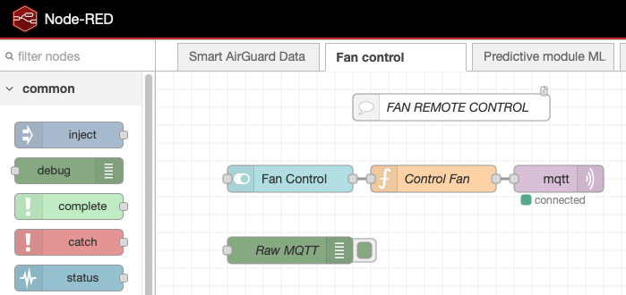

UI:


## 🤖 Telegram Bot

The Telegram bot is bridged through Node-RED (ESP32 never directly calls Telegram API). Supported commands:

| Command | Description | Example Response |
|---------|-------------|------------------|
| `/start` or `/help` | Show available commands | List of all commands with descriptions |
| `/status` | Full system status | `Gas: 450ppm (NORMAL), Temp: 22.5°C, Humidity: 55%, Motion: NO, Fan: AUTO` |
| `/sensors` | Real-time sensor data | `Temp: 22.5°C, Humidity: 55%, Gas: 450ppm, Motion: NO` |
| `/alerts` | Active hazard conditions | `GAS: NORMAL, TEMP: NORMAL, HUMIDITY: NORMAL` |
| `/fan on` | Manual fan activation | `Fan turned ON manually` |
| `/fan off` | Manual fan deactivation | `Fan turned OFF manually` |
| `/fan auto` | Return to automatic mode | `Fan switched to AUTO mode` |

### **TelegramBot layout**
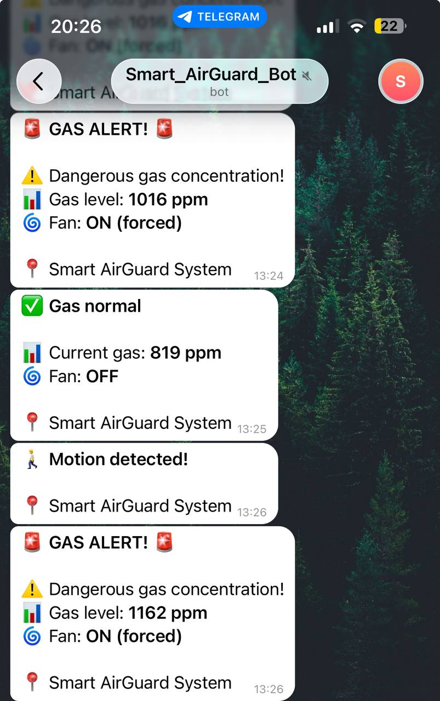

### **Automatic Push Notifications**
The system automatically sends alerts for:
- 🚨 **Gas >1000 ppm**: GAS ALERT! Concentration: XXXX ppm, Fan ON forced
- ✅ **Gas normal**: Gas normal. Current gas: XXX ppm
- 🌡️ **Temp <10°C or >35°C**: Temperature out of range! Current: XX°C
- 💧 **Humidity >90%**: High humidity detected! Current: XX%
- 🚶 **Motion detected**: Motion detected in garage
- 🔄 **Fan state change**: Fan turned ON/OFF/AUTO manually

Cooldown: 30 seconds between identical alert types to prevent spam.


## 🚨 Alert System

### **Priority Levels**
1. **CRITICAL** (Red LED ON, Buzzer ON, Fan ON forced, Telegram alert, blocks manual OFF)
   - Gas > 1000 ppm
   - Immediate fan activation
  
2. **MANUAL** (Fan follows user setting, auto-mode timeout after 5 min inactivity)
   - User command

3. **WARNING** (Yellow LED ON, Telegram notification)
   - Temp <10°C or >35°C
   
4. **NOTICE** (Green LED ON, Telegram notification)
   - Humidity >90%
   
5. **INFO** (RGB blue LED blinks (500ms), Telegram notification)
   - Motion detected/stopped

## Testing 
The Smart AirGuard system was validated through two types of experiments: controlled garage tests with real pollutant sources and extreme home stress tests. The following tables summarize all experimental outcomes.

### Garage Tests (Real Environment)

Seven tests were conducted in a real motorcycle and car workshop (4500 m³ volume) with varying ventilation conditions. Tests evaluated threshold sensitivity, false alarm prevention, and ventilation dependency.

| Test | Source | Door Position | Peak Gas (ppm) | Fan Activated	Recovery |
|-----------|----------|---------|------|---------|
|Test 1	| Scooter (1.5m)	| Fully open|	911| ❌ No	—| 
|Test 2	| Scooter (max)	| Fully open| 1008|	✅ Yes (<1s)	25s|
|Test 3	| Lighter gas	| Fully open| 1687| ✅ Yes	7s|
|Test 4	| Scooter	| Half open|1100| ✅ Yes	45s|
|Test 5	| Scooter	| Fully closed|1350| ✅ Yes	5 min|
|Test 6	| Aerosol spray	| Fully open| 405| ❌ No	—|
|Test 7	| Motor oil vapours	| Fully open|410| ❌ No	—|


### Home Stress Tests

Three additional tests were performed under extreme conditions using household appliances (humidifier, freezer, hair dryer) to validate system robustness beyond normal operating ranges.

| Test | Conditions | Key Findings |
|-----------|----------|---------|
|Test 8	| Humidity 100% + gas 1603 ppm	| Fan activated in <1s, humidity alert triggered, manual override functional |
|Test 9	| Freezer (-5.5°C) + gas 1999 ppm	| All sensors operational at -5.5°C, highest recorded gas reading (1999 ppm) |
|Test 10 |	Heat (42°C+) + gas 1076 ppm	| ⚠️ DHT22 failed at 42°C (requires power cycle), MQ-135 remained functional |

## Cost Estimation

The following tables break down all hardware and cloud service costs for both academic prototyping and commercial deployment scenarios.

### Hardware (One-time)

Total component cost per AirGuard unit is approximately **1.01 EUR**, making the system economically viable for garage and workshop deployment.

| Component | Cost (EUR) | 
|-----------|----------|
|ESP32 Development Board	| 4.60 |
|MQ-135 Gas Sensor	| 0.92 |
| DHT22 Sensor	| 2.60 |
| HC-SR501 PIR Sensor	| 2.50 |
| 0.96" OLED Display	| 1.48 |
| DC5V Cooling Fan |	1.00 |
| 5V 2-Channel Relay Module	| 1.00 |
|Custom PCB Prototype	| 4.00|
|Micro-USB Cables (2)	| 2.80|
|Active Buzzer	| 1.00|
|LEDs (Red, Yellow, Green)	| 1.63|
|RGB LED	| 1.48|
|F-M DuPont Cables (24)	| 1.00|
|Power Bank |	5.00|
|**Total Hardware**	|**31.01 EUR**|

### Cloud / Commercial Deployment (Annual)

Three architectural options are available for commercial deployment, each offering different trade-offs between cost, complexity, and functionality.

| Option | Architecture| Annual Cost |
|-----------|----------|---------|
|Option 1	|ThingSpeak only + Telegram	|210.24 EUR|
|Option 2	|Node-RED + Adafruit IO+ + Telegram	|85.15 EUR|
|Option 3	|Self-hosted Node-RED on VPS + Telegram	|96.00 EUR|
|Academic	|Free tiers (Adafruit IO Basic + ThingSpeak)	|0 EUR|

## Model Validation Framework

The Model Validation framework continuously assesses prediction accuracy by comparing forecasted gas values against actual sensor readings. Four standard metrics are calculated in real time.

| Metric | Target| Actual (Normal)| Actual (Gas Spike)|
|-----------|----------|---------|---------|
|MAE (Mean Absolute Error)	|<50 ppm	|<15 ppm	|40-80 ppm|
|RMSE (Root Mean Square Error)	|<75 ppm	|<25 ppm	|65-120 ppm|
|MAPE (Mean Absolute Percentage Error)	|<15%	|<5%	|5-12%|
|Accuracy	|>80%	|>95%	|65-85%|

**Recovery time after gas spike:** 30-60 seconds to baseline accuracy. Temporary prediction errors during sudden gas releases are expected and the model demonstrates robust recovery without systemic degradation.
