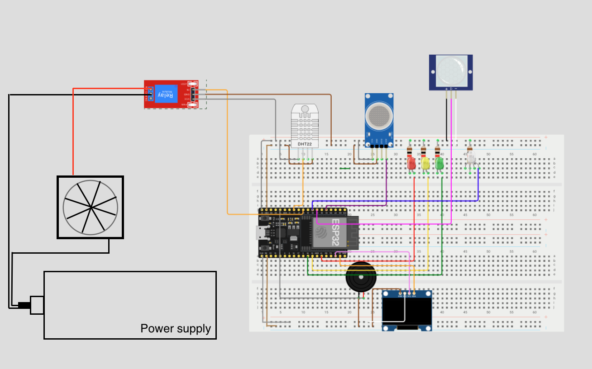
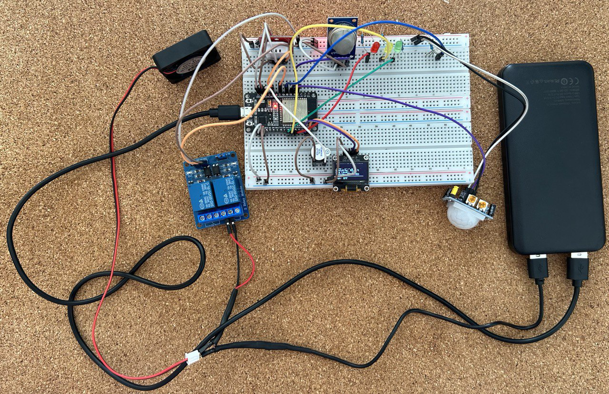
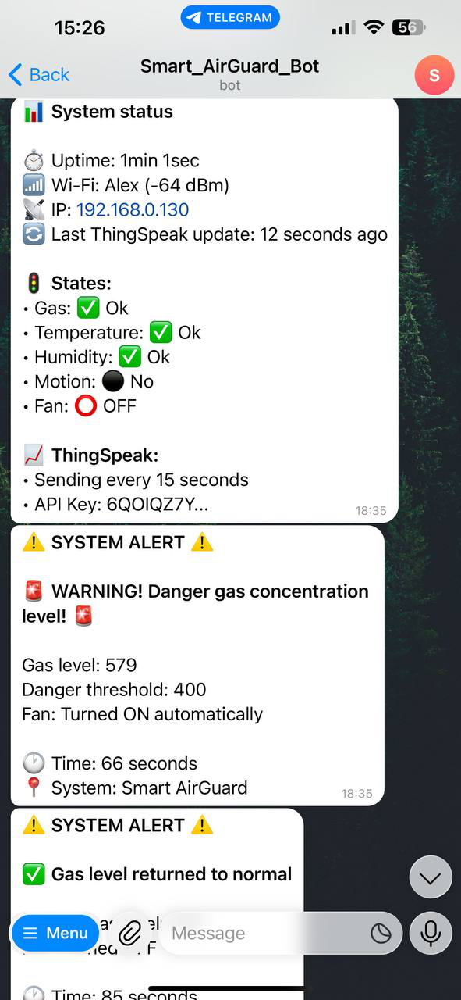
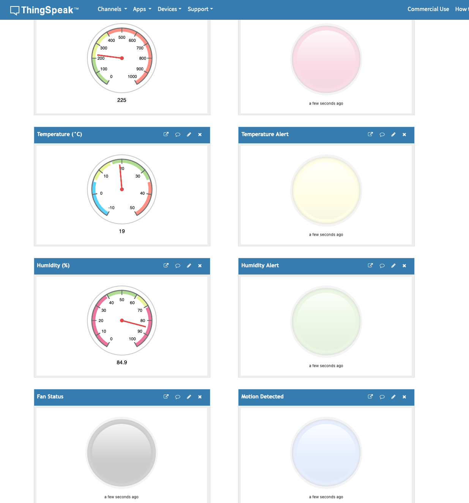
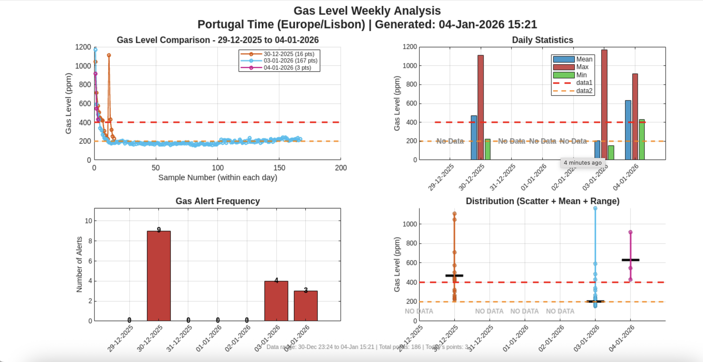

# Smart AirGuard - IoT Monitoring System

<div align="center">


*A comprehensive IoT-based air quality monitoring and alert system with real-time notifications*

</div>

## Table of Contents
- [Overview](#overview)
- [Features](#features)
- [System Architecture](#system-architecture)
- [Hardware Requirements](#hardware-requirements)
- [Wiring Diagram](#wiring-diagram)
- [Software Dependencies](#software-dependencies)
- [Telegram Bot Commands](#telegram-bot-commands)
- [ThingSpeak Integration](#thingspeak-integration)
- [Node-RED & Remote Monitoring](#node-red--remote-monitoring)
- [Alert System](#alert-system)
- [Local Display Information](#local-display-information)


## Overview

Smart AirGuard is an IoT-based environmental monitoring and safety system designed for enclosed automotive and indoor environments. The system continuously monitors air quality, temperature, humidity, and motion using a set of low-cost sensors, including the MQ-135 gas sensor, DHT22 temperature and humidity sensor, and a PIR motion sensor. Visual feedback is provided through RGB and status LEDs, while a local OLED display presents real-time sensor readings.

To ensure user safety, Smart AirGuard implements an intelligent alert and automation mechanism. When critical thresholds are exceeded — such as dangerous gas levels (>400 ppm), extreme temperature conditions, high humidity, or detected motion — the system sends instant notifications via a Telegram bot. For severe gas events, an audible buzzer alarm is triggered and an exhaust fan is automatically activated to reduce gas concentration.

The system uses an ESP32 microcontroller as its core, enabling real-time data processing, wireless communication, and cloud integration. Sensor data is periodically uploaded to the ThingSpeak cloud platform for remote monitoring and historical analysis. Two-way communication through Telegram allows users to remotely check system status and request live sensor data.

Overall, Smart AirGuard is a cost-effective, scalable, and reliable solution that combines real-time monitoring, automated risk mitigation, and cloud-based communication to improve air quality and safety in enclosed environments.


## Features

### 📊 **Multi-Sensor Monitoring**
- **Air Quality**: MQ-135 gas sensor for detecting harmful gases
- **Temperature & Humidity**: DHT22 sensor for climate monitoring
- **Motion Detection**: PIR sensor for presence detection
- **Visual Indicators**: RGB LED for motion, status LEDs for alerts

### 🔔 **Smart Alert System**
- **Instant Telegram Notifications** for:
  - Dangerous gas levels (>400 ppm)
  - Temperature extremes (<10°C or >35°C)
  - High humidity (>90%)
  - Motion detection
- **Audible Alarms**: Buzzer for critical gas levels
- **Automatic Ventilation**: Fan activation during high gas concentration

### 🌐 **Cloud Integration**
- **ThingSpeak Cloud**: Real-time data logging every 15 seconds
- **Telegram Bot**: Two-way communication with the system
- **Local Display**: 0.96 inch OLED for on-device monitoring

### 🎮 **Control & Interaction**
- Remote status checks via Telegram
- Real-time sensor data requests
- Alert configuration and monitoring
- System health monitoring

## System Architecture

```
┌─────────────────────────────────────────────────────────────┐
│                     Smart AirGuard System                   │
├─────────────────────────────────────────────────────────────┤
│  ┌─────────┐  ┌─────────┐  ┌─────────┐  ┌──────────────┐    │
│  │ DHT22   │  │ MQ-135  │  │ PIR     │  │ OLED         │    │
│  │ Temp/Hum│  │ Gas     │  │ Motion  │  │ Display      │    │
│  └────┬────┘  └────┬────┘  └────┬────┘  └─────┬───────-┘    │
│       │            │            │             │             │
├───────┼────────────┼────────────┼─────────────┼───────────-─┤
│       │            │            │             │             │
│  ┌────▼────┐ ┌────-▼───┐ ┌────-─▼──┐    ┌───-─▼──────┐      │
│  │ ESP32   │ │ RGB LED │ │ Buzzer  │    │ Relay      │      │
│  │         │ │ Status  │ │ Alarm   │    │ Fan        │      │
│  │         │ │ Ind.    │ │         │    │ Control    │      │
│  └────┬────┘ └─────────┘ └─────────┘    └────┬─────-─┘      │
│       │                                      │              │
├───────┼──────────────────────────────────────┼──────────--──┤
│       │                                      │              │
│  ┌────▼──────┐                      ┌───────-▼────┐         │
│  │ WiFi      │                      │ External    │         │
│  │ Connection│                      │ 5V Fan      │         │
│  └────┬──────┘                      └─────────────┘         │
│       │                                                     │
├───────┼───────────────────────────────────────────────────--┤
│       │                                                     │
│  ┌────▼────────────┐           ┌──────────────────┐         │
│  │ Telegram Bot    │◄─────────►│ ThingSpeak Cloud │         │
│  │ Notifications   │           │ Data Logging     │         │
│  │ & Control       │           │ & Analytics      │         │
│  └─────────────────┘           └──────────────────┘         │
└─────────────────────────────────────────────────────────────┘
```

## Hardware Requirements

### **Main Components**
| Component | Quantity | Purpose |
|-----------|----------|---------|
| ESP32 Dev Board | 1 | Main microcontroller |
| DHT22 Sensor | 1 | Temperature & humidity |
| MQ-135 Gas Sensor | 1 | Air quality monitoring |
| HC-SR501 PIR Sensor | 1 | Motion detection |
| OLED (0.96 inch) | 1 | Local display |
| RGB LED (Common Cathode) | 1 | Visual status indicator |
| 5V Relay Module | 1 | Fan control |
| 5V Fan | 1 | Ventilation |
| Active Buzzer | 1 | Audible alerts |
| LEDs (Red, Yellow, Green) | 3 | Alert indicators |
| Breadboards & Jumper Wires | - | Connections |

### **Power Requirements**
- **Input**: 5V DC via USB or external power supply
- **Current**: ~500mA (with all peripherals active)

## Wiring Diagram

### **ESP32 Pin Configuration**

| ESP32 Pin | Component | Signal | Notes |
|-----------|-----------|--------|-------|
| GPIO 14 | DHT22 | Data | Temperature & Humidity |
| GPIO 34 | MQ-135 | Analog | Gas Level (ADC) |
| GPIO 32 | PIR | Digital | Motion Detection |
| GPIO 23 | OLED | SDA | I2C Data |
| GPIO 22 | OLED | SCL | I2C Clock |
| GPIO 27 | RGB LED | Red | Common Cathode |
| GPIO 25 | RGB LED | Green | Common Cathode |
| GPIO 33 | RGB LED | Blue | Motion Indicator |
| GPIO 13 | Buzzer | Signal | Active Buzzer |
| GPIO 21 | LED | Red | Gas Alert |
| GPIO 19 | LED | Yellow | Temp Alert |
| GPIO 18 | LED | Green | Humidity Alert |
| GPIO 26 | Relay | Control | Fan ON/OFF |



### **Real physical board**


### **Power Connections**
- **3.3V**: DHT22, OLED, PIR sensor
- **5V**: MQ-135, Buzzer, LEDs, Relay module
- **GND**: All components

## Software Dependencies

### **Arduino Libraries Required**
```cpp
#include <Arduino.h>
#include <WiFi.h>
#include <HTTPClient.h>
#include <Wire.h>
#include <Adafruit_GFX.h>
#include <Adafruit_SSD1306.h>
#include <DHT.h>
#include <UniversalTelegramBot.h>
#include <ArduinoJson.h>
#include <WiFiClientSecure.h>
```

### **Library Installation**
1. Open Arduino IDE
2. Go to **Tools → Manage Libraries**
3. Search and install:
   - `Adafruit GFX Library`
   - `Adafruit SSD1306`
   - `DHT sensor library`
   - `Universal Telegram Bot`
   - `ArduinoJson`

## 🤖 Telegram Bot Commands

| Command | Description | Example Response |
|---------|-------------|------------------|
| `/start` or `/help` | Show help message | Command list and system info |
| `/status` | Current system status | Uptime, WiFi, sensor states |
| `/sensors` | Real-time sensor data | Temperature, humidity, gas levels |
| `/alerts` | Active alerts | Gas, temperature, humidity alerts |
| `/id` | Show your Chat ID | Unique identifier for notifications |

### **TelegramBot layout**


### **Automatic Alerts**
The system automatically sends alerts for:
- 🚨 **Gas**: Level > 400 ppm
- 🌡️ **Temperature**: Outside 10-35°C range
- 💧 **Humidity**: Above 90%
- 🚶 **Motion**: When detected

## 📊 ThingSpeak Integration

### **Data Fields Mapping**
| Field | Data | Type | Description |
|-------|------|------|-------------|
| 1 | Temperature | Float | Current temperature in °C |
| 2 | Humidity | Float | Current humidity in % |
| 3 | Gas Level | Integer | MQ-135 sensor reading |
| 4 | Motion | Binary | 1 = Detected, 0 = No motion |
| 5 | Gas Alert | Binary | 1 = Alert, 0 = Normal |
| 6 | Temp Alert | Binary | 1 = Alert, 0 = Normal |
| 7 | Humidity Alert | Binary | 1 = Alert, 0 = Normal |
| 8 | Fan Status | Binary | 1 = ON, 0 = OFF |

### **Dashboard Configuration**
Widgets created in ThingSpeak to visualize:
- Temperature & Humidity graphs
- Gas level history
- Motion detection timeline
- Alert status indicators
- Weekly Gas Level Analytics



#### Weekly Gas Level Analytics
This module analyzes gas concentration data collected by the Smart AirGuard system and stored on ThingSpeak.

What It Does:

- Retrieves gas level and alert data for the last 7 days
- Handles UTC → local (Portugal) timezone conversion
- Processes data on a daily basis


  
Key Metrics

Daily mean, maximum, and minimum gas levels

Alert count per day

Detection of days with missing data

📉 Visualizations

Daily gas level time-series comparison

Bar charts of daily statistics

Alert frequency per day

Distribution plots with safety thresholds (warning & danger levels)

## 🤖 Node-RED & Remote Monitoring

To simplify automation, visualization, and integration with multiple services, Smart AirGuard uses Node‑RED, a flow-based programming tool for IoT. Node‑RED allows you to visually connect sensors, alerts, cloud services, and Telegram notifications without writing complex code, making development and testing much faster and more intuitive.

For remote access and real-time monitoring from anywhere, the system can be connected to the internet using ngrok, which creates a secure public URL to the local Node‑RED instance. This allows users and developers to:

- Access the Node‑RED dashboard remotely from any device (phone, tablet, or laptop).

- Test automation flows and alerts without being physically near the device.

- Integrate with cloud services and APIs (like ThingSpeak or Telegram) seamlessly.

### Benefits of Node‑RED + ngrok for Smart AirGuard:

Remote Monitoring: View and control the system from anywhere.

Flexible Automation: Easily change flows for alerts, data logging, or device control.

Safe Testing Environment: Experiment with IoT flows without affecting the core ESP32 code.

Rapid Development: Visual programming speeds up prototyping and debugging.

## 🚨 Alert System

### **Priority Levels**
1. **CRITICAL** (Red LED + Buzzer + Telegram + Fan)
   - Gas level > 400 ppm
   - Immediate fan activation

2. **WARNING** (Yellow LED + Telegram)
   - Temperature outside range
   
3. **NOTICE** (Green LED + Telegram)
   - High humidity detected
   
4. **INFO** (RGB LED (Blue) + Telegram)
   - Motion detected/stopped

### **Alert Cooldown Mechanism**
- Each alert type has a 30-second cooldown
- Prevents notification spam
- Separate timers for gas, temperature, humidity
- Motion alerts have no cooldown for immediate response

## 🖥️ Local Display Information

The OLED display shows:
- Current sensor readings
- Alert status indicators
- Motion detection status
- Blue LED state (motion)
- Fan status
